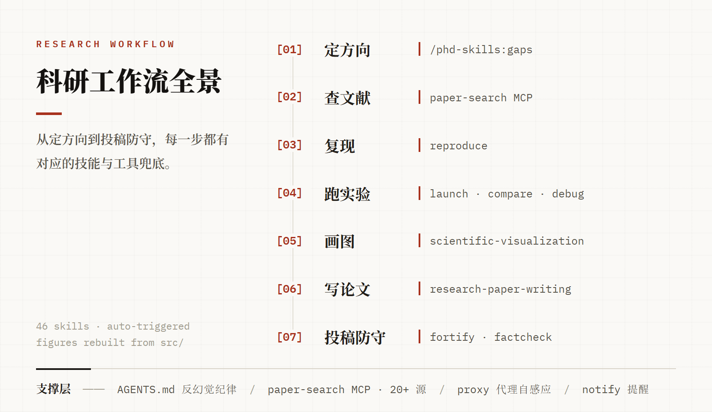

<p align="center">
  
</p>

# AI-Research-OS

[](LICENSE)
[]()
[]()
[]()

> 把 AI 编程助手调教成靠谱的**学术科研搭子**：不编论文、不乱改代码、查文献走权威源、写论文懂顶会套路。
>
> 一套开箱即用的 Agent 配置方案：行为纪律 + 技能组合 + MCP 服务器 + 网络自动化，覆盖"定方向 → 查文献 → 复现实验 → 画图 → 写论文 → 投稿防守"全链条。

[English README](README_EN.md) · [使用指南](docs/技能操作指南.md) · [技能清单](skills/README.md)

---

## ✨ 为什么值得用

| 痛点 | 本方案 |
|------|--------|
| 😤 AI 编造假论文引用 | 论文检索五要素核实制：标题/作者/年份/会议/链接必须来自同一条真实记录，查不到就明说 |
| 😤 AI 说"修好了"其实没修 | `verification-before-completion`：拿不出运行证据不许说完成 |
| 😤 出 bug 越改越乱 | `systematic-debugging`：先复现→挖根因→再修→验证，四步流程 |
| 😤 训练跑 50 小时发现配置错了 | `launch` 起飞前检查单 + `compare` 同 epoch 对齐对比 |
| 😤 投稿被审稿人秒杀 | `reviewer-defense` 预判审稿问题 + `/phd-skills:factcheck` 逐条查假引用 |
| 😤 开关代理后终端就断网 | `proxy-auto-detect.sh`：自动感应系统代理开关，终端永远在线 |
| 😤 需求说得糙，AI 就干偏 | `prompt-optimizer` MCP：糙话先转专业提示词，**你过目确认后** agent 才动手 |
| 😤 文献库还得手动整理 | `zotero` MCP：agent 直接查/存/引用你的 Zotero 文献库 |
| 😤 自己写的方案/代码没人挑刺，盲区全靠撞 | **ARIS 独立审稿桥（v4）** `aris-zhipu`：拉一个全新会话的 GLM 对你的代码/论文/方案对抗式评审，支持同线程追问 |
| 😤 深度科研全流程（选题→实验→论文→rebuttal）要自己串工具 | **ARIS 技能库对接（v4）**：83 个 skill 即读即用，方向池写一行即可夜间无人值守自动跑（断点续跑 + 卡死检测） |
| 😤 英文论文啃得慢 | `pdf2zh_next`：PDF 一键中英对照翻译，公式排版原样保留 |
| 😤 关机忘关梯子，开机断网 | `proxyguard.ps1`：开机自检，死代理残留自动纠正，0.15 秒跑完零常驻 |

## 🔬 科研工作流全景

<picture>
  <source media="(prefers-color-scheme: dark)" srcset="docs/images/research-workflow-dark.png">
  <source media="(prefers-color-scheme: light)" srcset="docs/images/research-workflow-light.png">
  
</picture>

## 🚀 快速开始

```bash
# 1. 克隆本仓库
git clone https://github.com/FengYM666/AI-Research-OS.git
cd AI-Research-OS

# 2. 一键安装全部推荐技能（Git Bash / Linux / macOS）
bash scripts/install.sh

# 3. 按需复制配置（详见下方"包含什么"）
# 4. 重启你的 agent 客户端，开聊！
```

试试这句：*"帮我找近三年 3D Gaussian Splatting 压缩方向的顶会论文，要有代码的"*

## 📦 包含什么

| 路径 | 说明 |
|------|------|
| `AGENTS.md` | **行为纪律**：执行前确认、计划拷问、改完代码强制验证（放用户目录全局生效） |
| `skills/` | 自研 `paper-search` 技能 + 精选第三方技能清单（附一键安装脚本） |
| `scripts/proxy-auto-detect.sh` | 终端代理自动感应（每次开 shell 读系统代理状态，开关梯子都不掉线） |
| `scripts/proxyguard.ps1` | 开机代理自检：防止"关机忘关梯子"残留导致的开机断网（Windows） |
| `scripts/notify.ps1` | 任务完成/出错的声音提醒 hook（Windows） |
| `config/config.example.json` | MCP 服务器配置样例（paper-search + Context7 + prompt-optimizer + zotero + codex 审稿桥），已脱敏 |
| `docs/技能操作指南.md` | 新手友好的中文使用手册：每个环节"你就这么说" |
| `mcp-servers/aris-zhipu/server.py` | **独立审稿桥（v4）**：零依赖 Python MCP 服务器，对 agent 暴露 ARIS 期望的 `codex`/`codex-reply` 工具契约，底层走智谱 GLM（Anthropic 兼容端点，Coding Plan key 直接用） |
| `templates/aris-lab/` | **自动科研工作区模板（v4）**：方向池 + 进度账本 + 说明，复制即用 |
| `templates/aris-nightly-cron-template.md` | **夜间无人值守定时任务的 prompt 模板（v4）**：ZCode CronCreate 直接粘贴 |

## 🧠 设计哲学

1. **流程 > 知识**：只装教 agent "怎么干活"的技能；知识类技能模型本来就会，装了是噪音
2. **证据 > 声称**：任何"完成/修好/发表"的声称必须附可验证的证据
3. **少即是多**：52 个精选技能 > 163 个全家桶，上下文越干净 agent 越聪明
4. **机制 > 自觉**：能写成 hook/脚本的规则，不靠模型自觉

## ❓ 常见问题

**Q: 技能太多会不会互相冲突？**
A: 不会。每个技能只在匹配场景触发，且我们刻意去掉了重叠的知识类技能。

**Q: 中国大陆网络能用吗？**
A: 原生适配。`proxy-auto-detect.sh` 自动感应梯子开关；谷歌学术检索自动走代理；jsdelivr 镜像作为免代理备胎。

**Q: 支持哪些客户端？**
A: 开发于 ZCode，技能遵循开放 [Agent Skills](https://agentskills.io) 标准，Claude Code / Cursor / Codex 等均可用。

## 🙏 致谢

本方案站在这些优秀开源项目的肩膀上：[obra/superpowers](https://github.com/obra/superpowers) · [fcakyon/phd-skills](https://github.com/fcakyon/phd-skills) · [Master-cai/Research-Paper-Writing-Skills](https://github.com/Master-cai/Research-Paper-Writing-Skills)（致谢[彭思达](https://github.com/pengsida)老师）· [HKUSTDial/Supervisor-Skills](https://github.com/HKUSTDial/Supervisor-Skills) · [K-Dense-AI/scientific-agent-skills](https://github.com/K-Dense-AI/scientific-agent-skills) · [openags/paper-search-mcp](https://github.com/openags/paper-search-mcp) · [anthropics/skills](https://github.com/anthropics/skills) · [wanshuiyin/Auto-claude-code-research-in-sleep](https://github.com/wanshuiyin/Auto-claude-code-research-in-sleep)（ARIS，v4 审稿桥与技能库对接的上游）

## 📮 联系方式

使用中遇到任何问题、有改进建议或想交流学术工具链，欢迎在 [Issues](https://github.com/FengYM666/AI-Research-OS/issues) 区提问和讨论。

## ⭐ Star History

[](https://star-history.com/#fengym666/ai-research-os&Date)

---

如果这套方案帮到了你，欢迎点个 ⭐ Star 支持一下！
