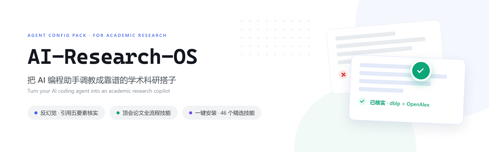
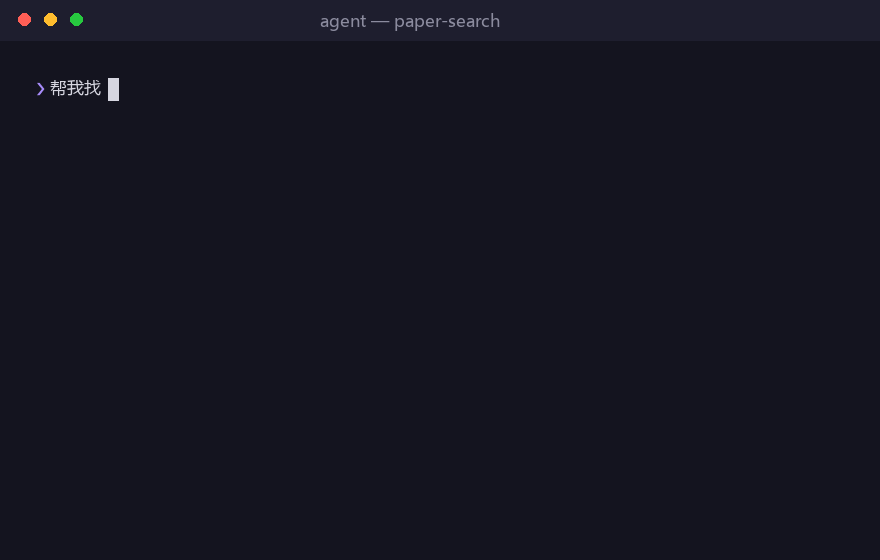

<p align="center">
  
</p>

# AI-Research-OS

[](LICENSE)
[]()

> Turn your AI coding agent into a reliable **academic research copilot** — no fabricated citations, no unverified "done", real literature from authoritative sources, and top-conference paper-writing know-how.
>
> A ready-to-use agent configuration: behavioral rules + curated skills + MCP servers + network automation, covering the full research loop: **topic discovery → literature search → reproduction → experiments → figures → paper writing → reviewer defense**.

[中文 README](README.md)

## ✨ Highlights

<p align="center">
  
</p>
<p align="center"><sub>Real query replay (OpenAlex) — a paper the model "remembered" is blocked because it wasn't in this round's search results</sub></p>

| Pain point | This setup |
|------------|-----------|
| AI fabricates paper citations | 5-element verification for every citation (title/authors/year/venue/link from one real record) |
| AI claims "fixed" without proof | `verification-before-completion` — evidence required before any success claim |
| Debugging spirals | `systematic-debugging` — reproduce → locate root cause → fix → verify |
| 50-hour training run wasted | `launch` pre-flight checklist + `compare` same-epoch run alignment |
| Desk-reject by reviewers | `reviewer-defense` + `/phd-skills:factcheck` (DBLP-verified citations) |
| Proxy toggling breaks terminal | `proxy-auto-detect.sh` senses the system proxy state on every new shell |
| Vague requests derail the agent | `prompt-optimizer` MCP rewrites rough asks into precise prompts — you approve before it acts |
| Zotero library managed by hand | `zotero` MCP: the agent searches/stores/cites your Zotero library directly |
| No one adversarially reviews your plan/code | **ARIS reviewer bridge (v4)** `aris-zhipu`: spawns a fresh GLM session to adversarially review your code/paper/proposal, with follow-up replies on the same thread |
| Full research pipeline (idea → experiments → paper → rebuttal) is DIY tool-glue | **ARIS skills integration (v4)**: 83 skills read-on-demand; write one line in the direction pool and an unattended nightly session runs it (resumable, stall-detection) |
| English papers are slow to read | `pdf2zh_next`: one-command bilingual PDF translation, formulas and layout preserved |
| Bloated context burns tokens | `headroom` MCP: auto-compresses oversized tool output into context (~89% saved in practice), original stored on disk for retrieval |
| Forgetting to close the proxy breaks the next boot | `proxyguard.ps1`: logon self-check auto-clears stale dead-proxy state (Windows, milliseconds, zero resident cost) |

## 🚀 Quick Start

```bash
git clone https://github.com/FengYM666/AI-Research-OS.git
cd AI-Research-OS
bash scripts/install.sh   # installs all recommended skills
```

Then restart your agent client and try: *"Find CVPR/ICCV papers from the last 3 years on 3D Gaussian Splatting compression, with official code."*

## 🧠 Philosophy

1. **Process over knowledge** — install skills that teach *how to work*, not facts the model already knows
2. **Evidence over claims** — no "done" without verifiable output
3. **Less is more** — 23 curated skills beat a 163-skill bundle
4. **Mechanism over discipline** — hooks and scripts enforce what good intentions can't

## 🙏 Acknowledgements

Built on: [obra/superpowers](https://github.com/obra/superpowers) · [fcakyon/phd-skills](https://github.com/fcakyon/phd-skills) · [Master-cai/Research-Paper-Writing-Skills](https://github.com/Master-cai/Research-Paper-Writing-Skills) · [HKUSTDial/Supervisor-Skills](https://github.com/HKUSTDial/Supervisor-Skills) · [K-Dense-AI/scientific-agent-skills](https://github.com/K-Dense-AI/scientific-agent-skills) · [openags/paper-search-mcp](https://github.com/openags/paper-search-mcp) · [anthropics/skills](https://github.com/anthropics/skills) · [wanshuiyin/Auto-claude-code-research-in-sleep](https://github.com/wanshuiyin/Auto-claude-code-research-in-sleep) (ARIS — upstream of the v4 reviewer bridge & skills integration)

## 📮 Contact

Questions, suggestions, or feedback: please open a thread in [Issues](https://github.com/FengYM666/AI-Research-OS/issues).

## ⭐ Star History

[](https://star-history.com/#fengym666/ai-research-os&Date)

---

⭐ Star this repo if it helps your research!
